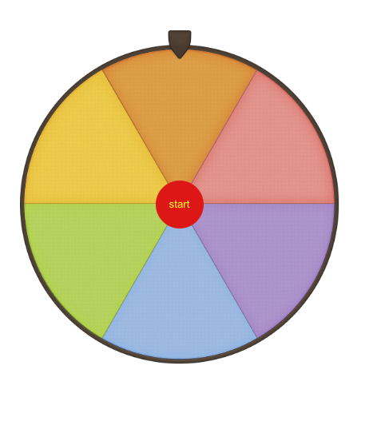

# roulette-img 사용 가이드 🧚‍♀️

---

##### 필요소스

- 룰렛 이미지 (확장자: png)
- 핀 이미지

## 이미지 준비

- 룰렛 이미지 이름은 **이미지이름-이미지번호.png**
  ex) rouletteImg-2.png , 여기서 이미지 번호는 룰렛의 칸 수를 나타냄.
- 이미지 모양
<div style="display: flex; justify-content: space-around; width=100vw;">
   
   
   
   
   
 </div>
      위의 룰렛 모양처럼 룰렛의 첫번째 요소가 정중앙에 위치해야함.

---

- 핀 이미지
  
  예시 이미지 입니다.

## 설치 및 임포트

```javascript
npm i roulette-img
```

```javascript
import { Roulette } from "roulette-img";
```

## 사용법

```javascript
//필요한 데이터 정리
export interface Roulette {
  imgUrl: string; //필수값
  arrowImgUrl: string; //필수값
  chunkRange: ChunkRange; //필수값
  chunk?: number;
  arrowPosition?: Arrow;
  winNumber?: winNumber;
  buttonText?: string;
  buttonShape?: ButtonShape;
  buttonStyle?: React.ReactNode; // 태그를 리턴값으로 보내 버튼을 커스터마이징 할 수 있습니다
  onWin?: (winNumber: number | null) => void;
}
```

```javascript
//필요한 고정 컴포넌트 입니다
<Roulette
  imgUrl="/assets/bg_circle-" //번호와 확장자를 제외한 "-"까지 적어주세요
  arrowImgUrl="/assets/arrow.png"
  chunkRange={{ start: 2, end: 6 }} //준비한 룰렛 이미지의 최소 칸과 최대 칸을 적어주세요
></Roulette>
```

```javascript
//선택 컴포넌트 입니다
<Roulette
  imgUrl="/assets/bg_circle-" //번호와 확장자를 제외한 "-"까지 적어주세요
  arrowImgUrl="/assets/arrow.png"
  chunkRange={{ start: 2, end: 6 }} //준비한 룰렛 이미지의 최소 칸과 최대 칸을 적어주세요
  chunk = 3 //룰렛의 칸 | 기본값:chunkRange.start | [chunkRange의" 범위]
  arrowPosition = "up" //핀의 위치 | 기본값 :"up" | ["up","down","left","right]
  winNumber //당첨 번호 | 기본값: 랜덤 | [chunkRange의" 범위]
  buttonText = "start" //버튼텍스트 | 기본값: start
  buttonShape = "round" //버튼 모양 | 기본값: round | [round,squre]
></Roulette>
```

## 설정에 따른 모양

```javascript
<Roulette
  imgUrl="/assets/bg_circle-"
  arrowImgUrl="/assets/arrow.png"
  chunkRange={{ start: 2, end: 6 }}
  chunk = 2
  arrowPosition = "up" //핀의 위치 | 기본값 :"up" | ["up","down","left","right]
  buttonText = "start" //버튼텍스트 | 기본값: start
  buttonShape = "round" //버튼 모양 | 기본값: round | [round,squre]
></Roulette>
```


```javascript
<Roulette
  imgUrl="/assets/bg_circle-"
  arrowImgUrl="/assets/arrow.png"
  chunkRange={{ start: 2, end: 6 }}
  chunk = 4
  arrowPosition = "left" //핀의 위치 | 기본값 :"up" | ["up","down","left","right]
  winNumber={{number:4,option:"none"}} //당첨 번호 | 기본값: 랜덤 | [chunkRange의" 범위]
  buttonText = "start" //버튼텍스트 | 기본값: start
  buttonShape = "square" //버튼 모양 | 기본값: round | [round,squre]
></Roulette>
```


---

## 스타일링 변경

룰렛 이미지 - .roulette
핀 이미지 - .arrow
스타트 버튼 - .start-button

```javascript
  .start-button {
    color: yellow;
    background-color: red;
  }
```



## version 0.3.0 추가 기능

1. 당첨 번호 콜백 함수

```javascript
const [winNumber, setWinNumber] = useState(0);

const getWinNumber = (number: number) => {
  setWinNumber(number);
};

<Roulette
  imgUrl="/assets/bg_circle-"
  arrowImgUrl="/assets/arrow.png"
  chunkRange={{ start: 2, end: 6 }}
  onWin={getWinNumber}
></Roulette>;
```

- 위와 같은 방법으로 당첨 번호를 컨트롤할 수 있습니다.

2. 버튼 커스텀 기능

```javascript
<Roulette
  imgUrl="/assets/bg_circle-"
  arrowImgUrl="/assets/arrow.png"
  chunkRange={{ start: 2, end: 6 }}
  buttonStyle={
    <>
      <button>hello</button>
    </>
  }
></Roulette>
```

- 위와 같은 방법으로 고정 버튼이 아닌 직접 버튼을 커스텀 할 수 있습니다.
- 우선순위 buttonText,buttonShape < button.style

---

## version 0.3.2 추가 기능

당첨번호를 외부 api에서 받아온 후 넘길수 있습니다.

```javascript
//winNumber 타입이 변경되었습니다.
export interface Roulette {
  ...
  winNumber?: winNumber;
  ...
}

type winNumber = {
  number: number | null,
  option?: winNumberOption,
};

export type winNumberOption = "async" | "none";
//async옵션은 외부 api에서 당첨번호를 받아와 사용할때 - buttonStyle옵션을 사용해 커스터마이징 버튼을 만든후 직접 api와 연결해주세요
//none옵션은 그저 로컬에서 내가 지정한 값을 넣고싶을때
```

```javascript
  const [winNumber, setWinNumber] = useState<number | null>(null);

  const clickButton = () => {
    //예시로 비동기 함수 setTimeout을 사용했습니다.
    setTimeout(() => {
      setWinNumber(2);
    }, 3000);
  };


  return(
    <div className="App">
      //비동기로 받아올때
      <Roulette
        imgUrl="/assets/bg_circle-"
        arrowImgUrl="/assets/arrow.png"
        chunkRange={{ start: 2, end: 6 }}
        winNumber={{ number: winNumber, option: "async" }}
        buttonStyle={
          <>
            <button onClick={clickButton}>hello</button>
          </>
        }
      ></Roulette>
      //직접 값을 선언
        <Roulette
        imgUrl="/assets/bg_circle-"
        arrowImgUrl="/assets/arrow.png"
        chunkRange={{ start: 2, end: 6 }}
        chunk={4}
        winNumber={{ number: 2 }}
        arrowPosition="left"
        buttonShape="squre"
      ></Roulette>

      //랜덤값 사용
      <Roulette
        imgUrl="/assets/bg_circle-"
        arrowImgUrl="/assets/arrow.png"
        chunkRange={{ start: 2, end: 6 }}
        chunk={4}
        // winNumber={{ number: 2 }}
        arrowPosition="left"
        buttonShape="squre"
      ></Roulette>

      );
```
