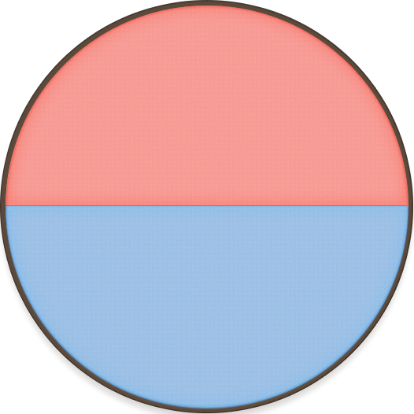

# roulette-img 사용 가이드 🧚‍♀️

---

##### 필요소스

- 룰렛 이미지 (확장자: png)
- 핀 이미지

## 이미지 준비

- 룰렛 이미지 이름은 **이미지이름-이미지번호.png**
  ex) rouletteImg-2.png , 여기서 이미지 번호는 룰렛의 칸 수를 나타냄.
- 이미지 모양
<div style="display: flex; justify-content: space-around; width=100vw;">
   
   
   
   
   
 </div>
      위의 룰렛 모양처럼 룰렛의 첫번째 요소가 정중앙에 위치해야함.

---

- 핀 이미지
  
  예시 이미지 입니다.

## 설치 및 임포트

```javascript
npm i roulette-img
```

```javascript
import { Roulette } from "roulette-img";
```

## 사용법

```javascript
//필요한 고정 컴포넌트 입니다
<Roulette
  imgUrl="/assets/bg_circle-" //번호와 확장자를 제외한 "-"까지 적어주세요
  arrowImgUrl="/assets/arrow.png"
  chunkRange={{ start: 2, end: 6 }} //준비한 룰렛 이미지의 최소 칸과 최대 칸을 적어주세요
></Roulette>
```

```javascript
//선택 컴포넌트 입니다
<Roulette
  imgUrl="/assets/bg_circle-" //번호와 확장자를 제외한 "-"까지 적어주세요
  arrowImgUrl="/assets/arrow.png"
  chunkRange={{ start: 2, end: 6 }} //준비한 룰렛 이미지의 최소 칸과 최대 칸을 적어주세요
  chunk = 3 //룰렛의 칸 | 기본값:chunkRange.start | [chunkRange의" 범위]
  arrowPosition = "up" //핀의 위치 | 기본값 :"up" | ["up","down","left","right]
  winNumber //당첨 번호 | 기본값: 랜덤 | [chunkRange의" 범위]
  buttonText = "start" //버튼텍스트 | 기본값: start
  buttonShape = "round" //버튼 모양 | 기본값: round | [round,squre]
></Roulette>
```

## 설정에 따른 모양

```javascript
<Roulette
  imgUrl="/assets/bg_circle-"
  arrowImgUrl="/assets/arrow.png"
  chunkRange={{ start: 2, end: 6 }}
  chunk = 2
  arrowPosition = "up" //핀의 위치 | 기본값 :"up" | ["up","down","left","right]
  winNumber //당첨 번호 | 기본값: 랜덤 | [chunkRange의" 범위]
  buttonText = "start" //버튼텍스트 | 기본값: start
  buttonShape = "round" //버튼 모양 | 기본값: round | [round,squre]
></Roulette>
```


```javascript
<Roulette
  imgUrl="/assets/bg_circle-"
  arrowImgUrl="/assets/arrow.png"
  chunkRange={{ start: 2, end: 6 }}
  chunk = 4
  arrowPosition = "left" //핀의 위치 | 기본값 :"up" | ["up","down","left","right]
  winNumber //당첨 번호 | 기본값: 랜덤 | [chunkRange의" 범위]
  buttonText = "start" //버튼텍스트 | 기본값: start
  buttonShape = "square" //버튼 모양 | 기본값: round | [round,squre]
></Roulette>
```


